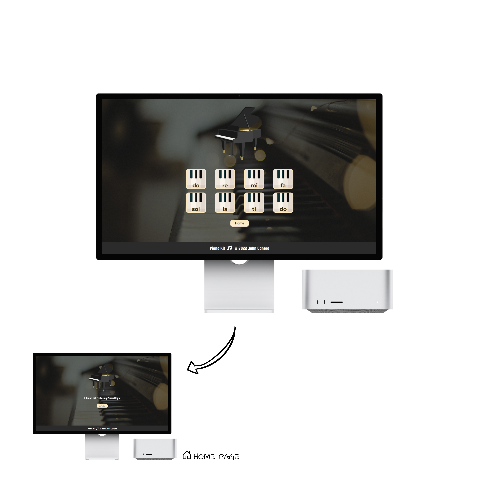
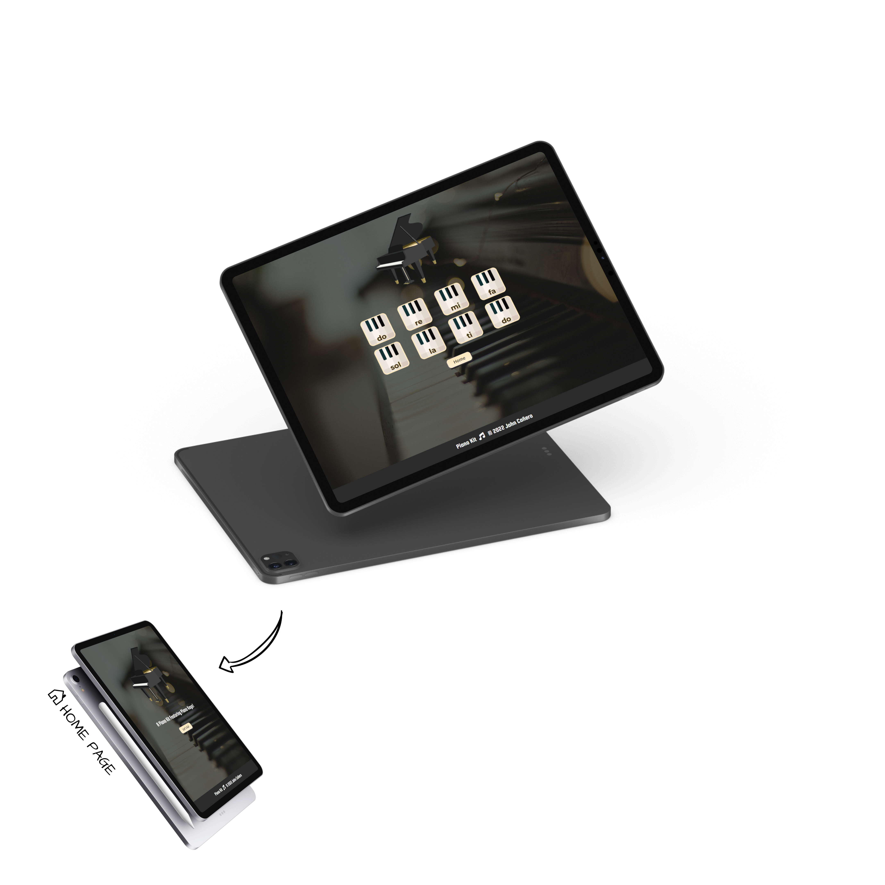
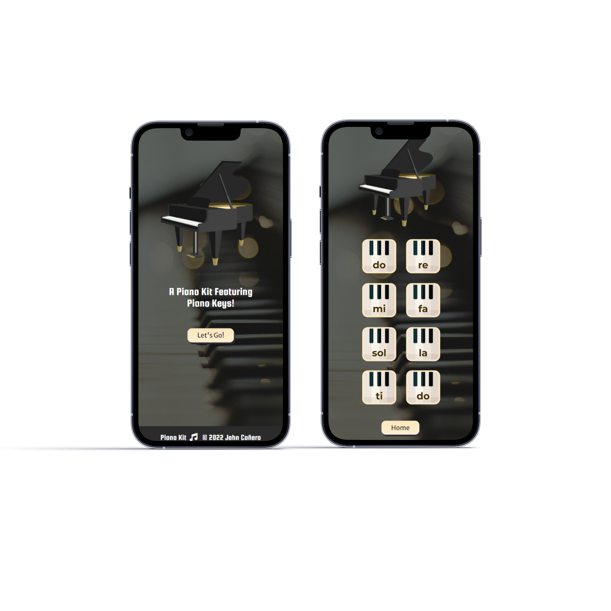
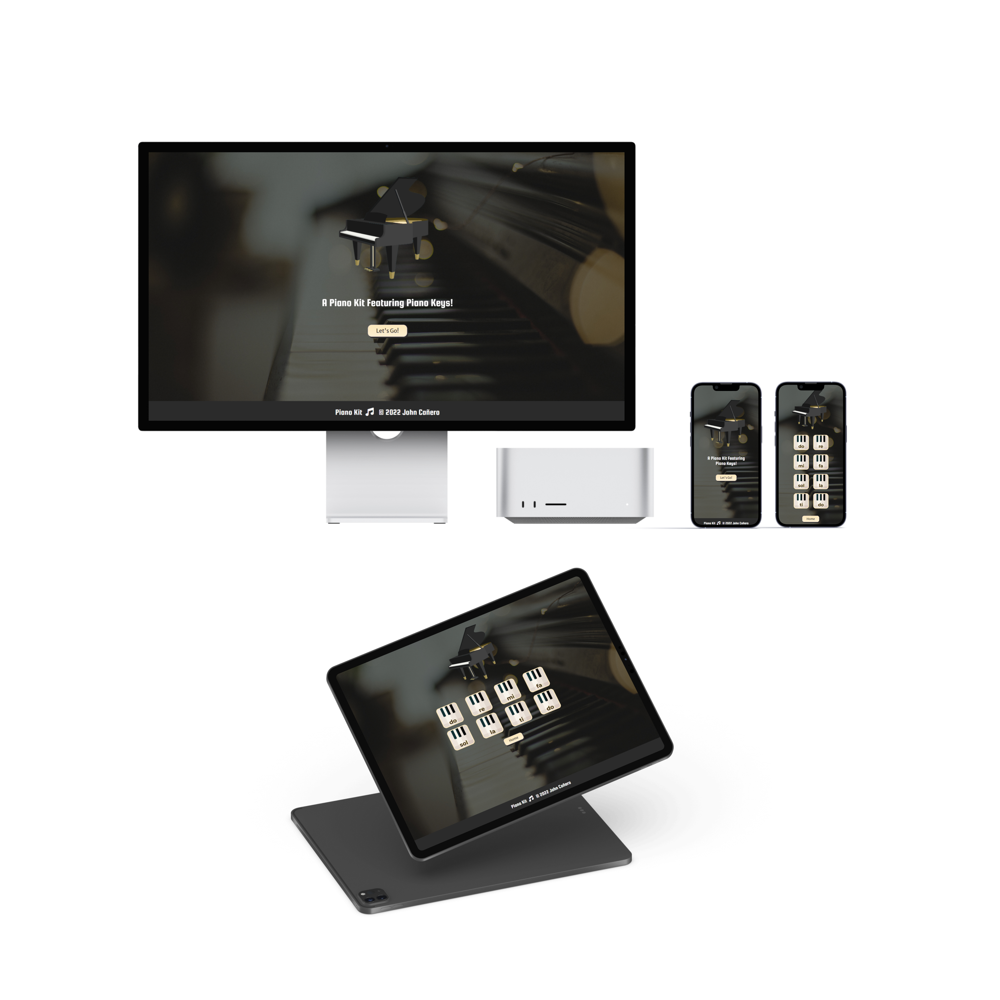

# Piano Kit Jam

Hello Git and Github! 👋

This is my first time incorporating Git. I believe this is a powerful tool to save every programming project in the repository. 🟠 In this project, PianoKit is presented and it features key buttons and audio to remember back and reminisce the famous rhyme we hear back in our youth: "Do-re-mi-fa-so-la-ti-do" 🎵

Let's go and build some stuffs! 🎹

